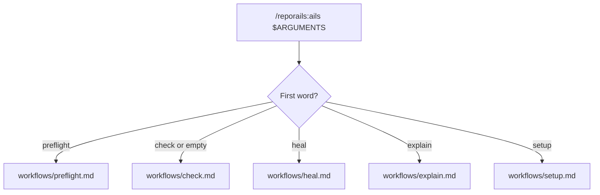

# /reporails:ails — Instruction File Diagnostics

Invoke this skill as `/reporails:ails <subcommand> <args>`.
Parse the first word of `$ARGUMENTS` as the subcommand.
Run the `check` workflow when `$ARGUMENTS` names none.

## Subcommand routing

Read the `workflows/<subcommand>.md` file named below.
Follow the steps listed in that `workflows/<subcommand>.md` file.

| Subcommand                    | Workflow                                           | What it does                                                            |
|--------------------------------|----------------------------------------------------|-------------------------------------------------------------------------|
| `preflight <capability>`      | [`workflows/preflight.md`](workflows/preflight.md) | Fetches the rules for authoring a `SKILL.md`, an agent, or a rule       |
| `check [path] [targets…]`     | [`workflows/check.md`](workflows/check.md)         | Validates instruction files, reports the score and per-file findings    |
| `heal [path] [targets…]`      | [`workflows/heal.md`](workflows/heal.md)           | Fixes your instruction files one kind at a time and reports what changed and what it left for you (paid account) |
| `explain <rule_id>`           | [`workflows/explain.md`](workflows/explain.md)     | Shows what one rule checks and how to satisfy it                        |
| `setup`                        | [`workflows/setup.md`](workflows/setup.md)         | Installs the engine and connects the `reporails` MCP server to the agent |

Run `workflows/preflight.md` before drafting a new `SKILL.md`, agent, or `.claude/rules/*.md` file.

## Tool detection and fallback

Find tool detection, the setup offer and the CLI fallback order in [`workflows/setup.md`](workflows/setup.md).

## `check` / `heal` arguments

`$ARGUMENTS` after `check` or `heal` is `[path] [targets…]`.
`path` is an optional project path.
Targets are zero or more words narrowing which locations the workflow covers.
A word is the `path` only when it names a project root rather than one of the target shapes below.
Leave `path` out and the workflow uses the project already in use this session.
Read every other word in `$ARGUMENTS` as a target:

- a bare capability — `skills`, `agents`, `rules` — for every location of that kind
- `capability:name` for one of them — `skills:backlog`, `agents:remedy` (the singular spellings `skill:`, `agent:`, `rule:` read the same)
- `@main` for the project's root instruction file
- a path to a file or folder — read against `path` when relative

No targets given checks or heals the whole project.
Examples: `heal skills` (every skill), `heal skills:backlog` (one skill), `heal agents` (every agent).
Pass whatever `targets` you parsed through unchanged to the workflow.
The workflow threads them into every `validate` and `remedy_brief` call it makes.
