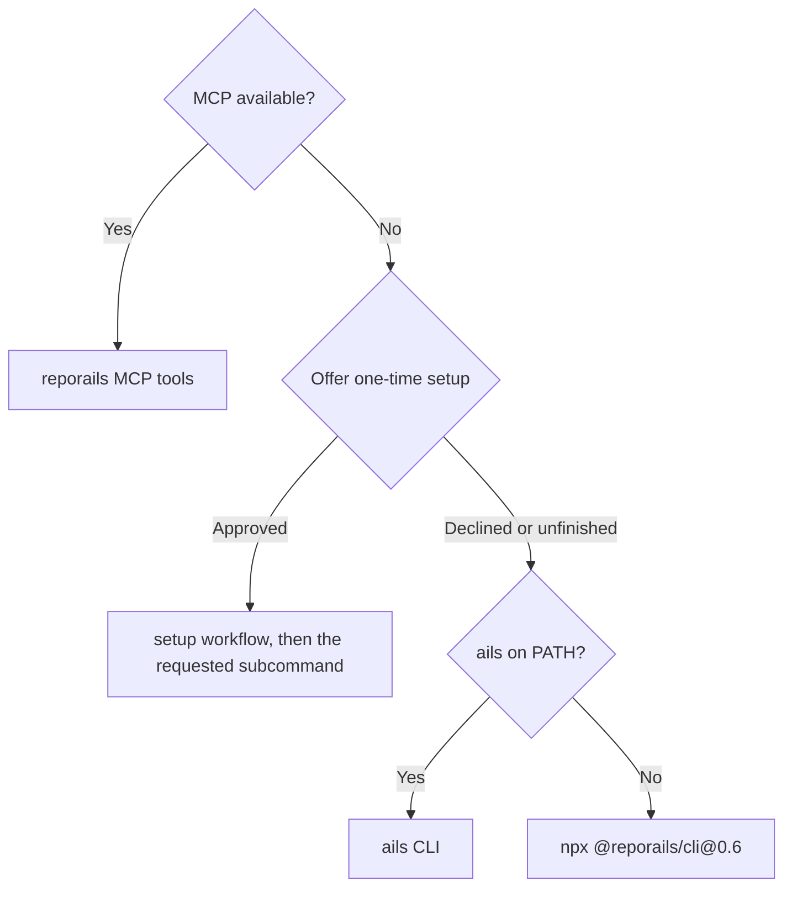

# Setup — reporails-cli Installation

Run this when `command -v ails` finds nothing, or when the user asks for `setup`.
It leaves the machine in the same state as `npx @reporails/cli@0.6 install`: `uv` installed, `ails` on `PATH`, this plugin installed into Claude Code and Codex, and the engine prepared.

## Tool detection

Check the tool list for the `reporails` MCP server's `validate` tool first.
Its name depends on how the server was added.
In Claude Code it is `mcp__plugin_reporails_reporails__validate` when this plugin installed the server.
In Claude Code it is `mcp__reporails__validate` when you added the server yourself.
Search for the `reporails__validate` ending, which matches either name.
Call the server's `validate`, `preflight`, and `explain` tools first when MCP is connected.
They share the `validate` tool's prefix, and they return structured `JSON` carrying per-finding `fix` text and rule bodies.



## One-time setup offer

Offer the one-time setup before any CLI fallback when the `reporails` MCP tools are unavailable.
Run the one-time setup when the `reporails` tools are missing from the tool list.
Run it also when a step needs the `ails` command (signing in) and `command -v ails` finds nothing.
Tell the user `reporails` needs a one-time setup and ask to run it.
Run the `setup` workflow once they approve, which runs `npx @reporails/cli@0.6 install`.
Continue with the requested subcommand once the `setup` workflow finishes.
*Do not run the setup while the `reporails` tools are connected and no step needs the `ails` command.*
*Do not run the setup without the user's approval.*
*Do not fall back to the CLI before offering the setup.*

## CLI fallback order

Run `ails check .` or `ails explain <rule_id>` directly when `ails` is on `PATH`.
Run `npx @reporails/cli@0.6 check .` when no `ails` binary is installed.
Offer the faster path afterward: `uv tool install reporails-cli && ails install`.
*Do not fall back to the CLI unless the user declines the setup or it could not finish.*

## Install

Run `command -v npx` and `command -v uv` to see which tools are present.

When `npx` is present, run:

```bash
npx @reporails/cli@0.6 install
```

When `npx` is missing and `uv` is present, run:

```bash
uv tool install reporails-cli && ails install
```

When both are missing, tell the user to install `Node.js` from https://nodejs.org or `uv` from https://docs.astral.sh/uv/, then run `setup` again, and stop.

The install ends by pointing to `ails login`.
The `heal` workflow offers sign-in when it needs one.
*Do not sign the user in during setup unless they ask.*

## After the install

Run `ails --version` to confirm the install.
Report the installed `ails` version from that output to the user.
Tell the user to open a new terminal so the updated `PATH` loads when the command is not found, then run it again.

## MCP not connected

Find the `validate` tool again as `## Tool detection` above directs.
Run `command -v uvx` to check it is present when the tool is missing after the install, since the MCP server launches through `uvx`.

When this plugin is installed, it already registers the server.
The usual cause is a first start that timed out while downloading the command-line tool and its dependencies (once per machine).
Tell the user to reconnect the `reporails` server once the download is done (Claude Code: `/mcp`), or to restart the agent.
*Do not register a second server in that case.*

When the skill runs without the plugin, register the MCP server for the user's agent directly, once `uvx` is confirmed present.
In Claude Code, run:

```bash
claude mcp add reporails -- uvx --from 'reporails-cli>=0.6.0,<0.7' reporails-mcp
```

For another agent, add an MCP server entry naming the same command and args (`uvx --from 'reporails-cli>=0.6.0,<0.7' reporails-mcp`) to that agent's own MCP config file.
Restart the agent afterward so it loads the `reporails` server entry.
